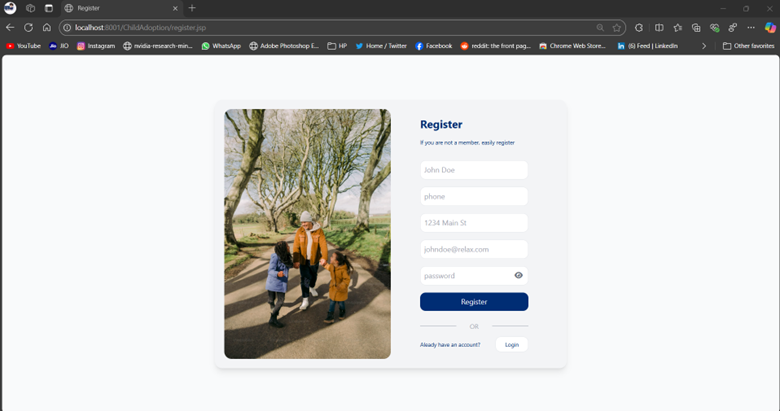

# Child Adoption Portal

<p float="left">


</p>
<p float="left">


</p>


Welcome to the **Child Adoption Portal** project! This web application is designed to streamline the adoption process by connecting prospective parents with adoption agencies. Built using **JSP and Servlets**, the portal focuses on a user-friendly experience while ensuring data security and compliance.


---

## Table of Contents

- [Child Adoption Portal](#child-adoption-portal)
  - [Table of Contents](#table-of-contents)
  - [Features](#features)
  - [Flowchart](#flowchart)
  - [Technologies Used](#technologies-used)
  - [Setup Instructions](#setup-instructions)
  - [Usage](#usage)
  - [Project Screenshots](#project-screenshots)
    - [Home Page](#home-page)
    - [Login Page](#login-page)
    - [Register Page](#register-page)
    - [Dashboard](#dashboard)
    - [Profile](#profile)
    - [Admin Page](#admin-page)
    - [Contact Page](#contact-page)

---

## Features

- **User Registration and Login**: Secure access to the portal with user authentication.
- **Dashboard**: View available children for adoption and monitor your requests.
- **Admin Features**:
  - Manage users and adoption requests.
  - Add or update information about children available for adoption.
- **Contact Support**: Get assistance from the team directly via the contact page.
- **Responsive Design**: Optimized for various devices using Tailwind CSS.

---

## Flowchart


---

## Technologies Used

- **Frontend**: JSP, Tailwind CSS
- **Backend**: Servlets, Java
- **Database**: MySQL
- **Server**: Apache Tomcat
- **IDE**: Eclipse

---

## Setup Instructions

1. Clone the repository:
   ```bash
   git clone https://github.com/your-repo-url.git
   cd ChildAdoptionPortal
   ```
2. Import the project into Eclipse:
   - Open Eclipse and select `File > Import > Existing Projects into Workspace`.
   - Navigate to the cloned directory and import the project.

3. Configure the database:
   - Create a MySQL database named `child_adoption`.
   - Run the SQL script located in `src/main/resources/db/schema.sql` to set up the tables.
   - Update the `DBConnection` class with your database credentials.

4. Deploy the application:
   - Add the project to an Apache Tomcat server in Eclipse.
   - Start the server and access the application at `http://localhost:8080/ChildAdoption`.

---

## Usage

1. **For Users**:
   - Register and log in to access the portal.
   - Browse children available for adoption and submit adoption requests.
2. **For Admins**:
   - Log in with admin credentials to manage users, adoption requests, and children details.

---

## Project Screenshots

### Home Page


### Login Page


### Register Page


### Dashboard


### Profile


### Admin Page


### Contact Page


---

**© 2024 Java Jedis**
